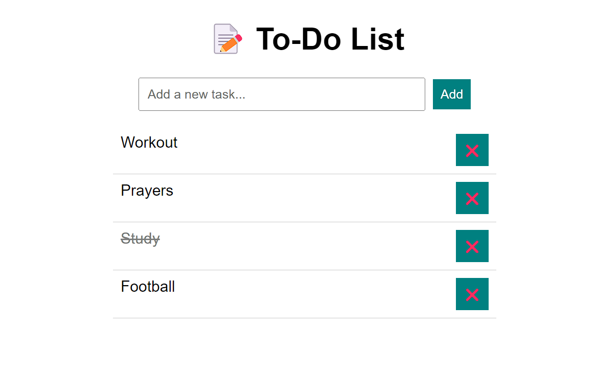

# 📝 React To-Do List App

A clean, modern, and responsive **To-Do List App** built using **React.js**. Manage your daily tasks with features like dark mode, priority selection, filtering, and local storage — all in one place.

---

## 🚀 Live Demo

🔗 [Click here to view the live site](https://haidertodolist.netlify.app/)

---

## 📸 Screenshots



---

## ⚙️ Features

- ✅ **Add, edit, delete tasks**
- 🔢 **Task numbering**
- 🔄 **Mark tasks as completed**
- 🌗 **Dark / Light mode toggle**
- 🎯 **Priority levels** (High / Medium / Low)
- 🔍 **Filter tasks**: All, Active, Completed
- 🧹 **Clear all tasks** with one click
- 💾 **Persistent data** with `localStorage`
- 📱 **Responsive design** for all screens

---

## 🛠️ Tech Stack

- **Frontend:** React.js (Hooks)
- **Styling:** CSS3
- **Icons:** Emojis 🎉

---

## 🧩 Folder Structure

todo-list/
├── public/
│ └── output.png
├── src/
│ ├── components/
│ │ ├── TodoForm.jsx
│ │ ├── TodoList.jsx
│ │ └── TodoItem.jsx
│ ├── App.css
│ └── App.jsx
├── package.json
└── README.md


---

## 📦 Getting Started

### 1. Clone this repository
```bash
git clone https://github.com/your-username/todo-list.git
cd todo-list
npm install
npm start


🙌 Author
Haider Mirza
📬 Connect on LinkedIn
🧑‍💻 haidermirza7072@gmail.com